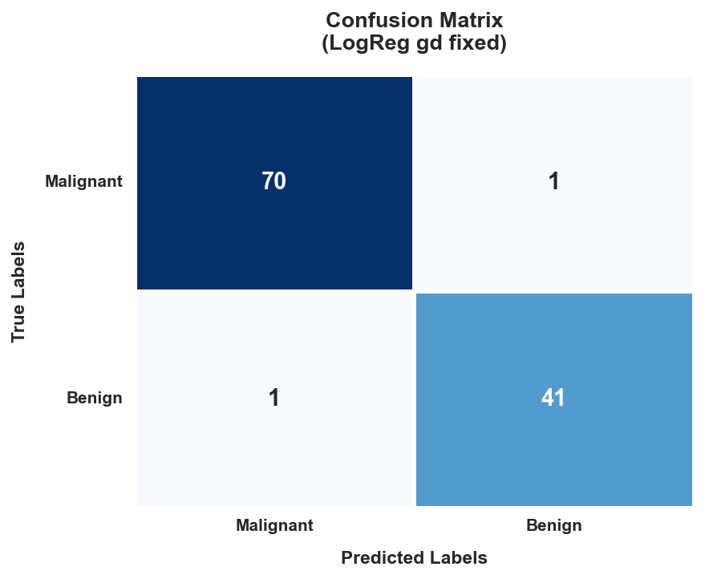

# High-Dimensional Breast Cancer Diagnostics from Scratch

An end-to-end framework implementing supervised learning classifiers, orthogonal dimension reductions (PCA via SVD), and multi-solver optimization architectures completely from scratch using vectorized NumPy mathematics.

## 🚀 Key Performance Benchmarks
| Model Identifier | Accuracy | F1-Score | Type |
| :--- | :---: | :---: | :---: |
| **LogReg_gd_fixed** | **98.23%** | **97.62%** | Scratch Model |
| **LogReg_PCA10** | **98.23%** | **97.62%** | Scratch + PCA |
| **SVM_rbf** | 98.23% | 97.56% | scikit-learn Baseline |
| **LinReg_normal** | 94.69% | 92.50% | Closed-Form Scratch |

---

## 📊 Empirical Analysis & Visualization Grid

| Model Artifact | Diagnostic Insights |
| :---: | :--- |
|  | **Clinical Risk Optimization:** Retains an optimal recall profile by limiting critical diagnostic false negatives to exactly 1 missed instance out of 113 test samples. |
|  | **Multicollinearity Mapping:** Visualizes the extreme structural dependency ($r \geq 0.95$) between cell metrics which challenges unregularized matrix inversions. |
|  | **Orthogonal Class Separation:** Demonstrates distinct geometric class clustering along the first Principal Component (PC1) via SVD dimension reduction. |
|  | **Optimization Dynamics:** Contrasts second-order curvature-aware Newton-Raphson solvers (immediate convergence) against iterative first-order routines. |

---

## 🛠️ Installation & Reproduction
1. Clone the repository:
   ```bash
   git clone [https://github.com/YOUR_USERNAME/week1-rls-breast-cancer.git](https://github.com/YOUR_USERNAME/week1-rls-breast-cancer.git)
   cd week1-rls-breast-cancer
